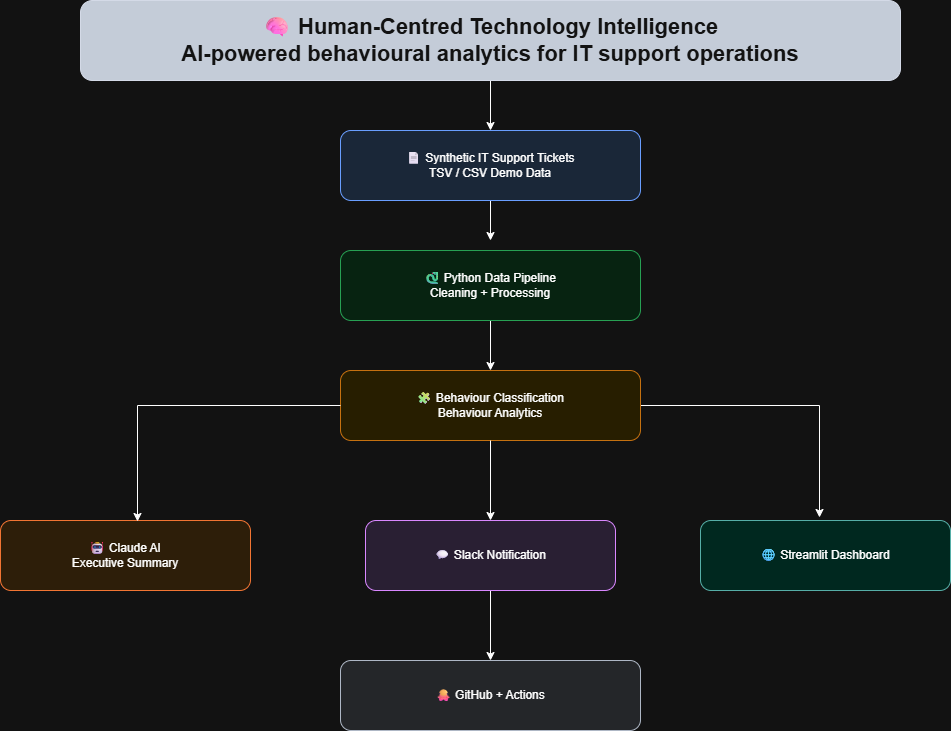
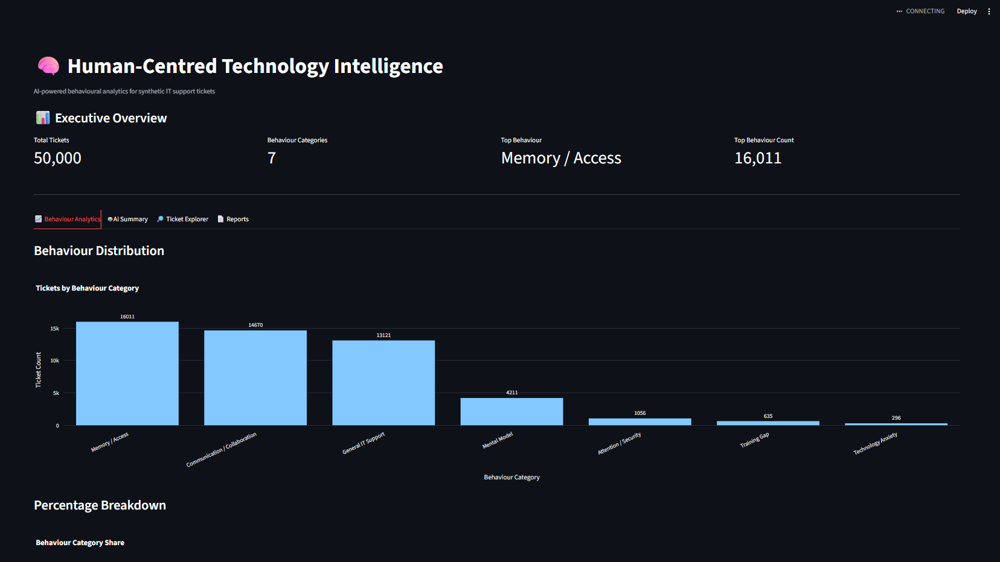
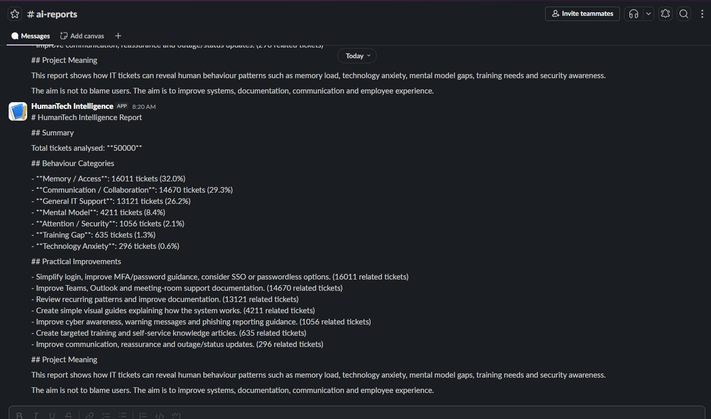
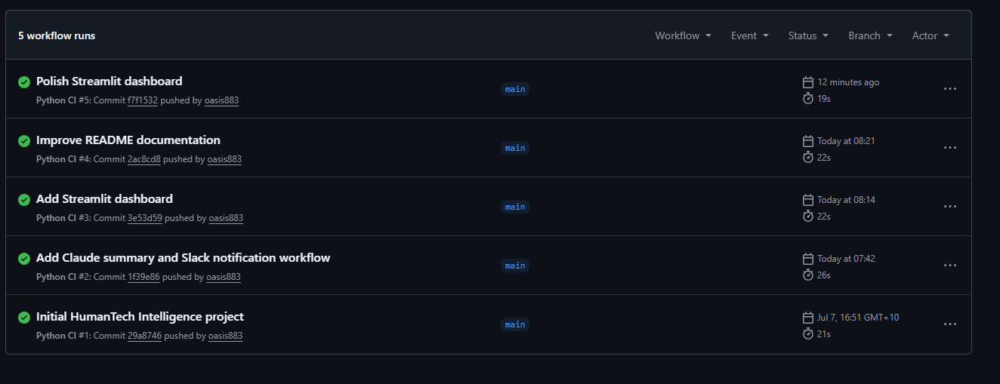

# 🧠 Human-Centred Technology Intelligence
[](YOUR_STREAMLIT_URL)


> **AI-powered behavioural analytics for IT support operations using Python, Claude AI, Streamlit, Slack, and GitHub Actions.**

[](https://www.python.org/)
[](https://streamlit.io/)
[](https://www.anthropic.com/)
[](https://github.com/features/actions)

---

# 📖 Overview

**Human-Centred Technology Intelligence** is a personal portfolio project exploring how Artificial Intelligence and behavioural analytics can improve the employee technology experience.

Instead of treating IT support tickets as isolated technical incidents, this project analyses **synthetic IT support ticket data** to identify recurring behavioural patterns, technology friction, communication challenges, and opportunities to improve systems, documentation, and user experience.

The project demonstrates an end-to-end workflow combining data processing, AI, automation, and interactive dashboards.

---

# 🎯 Project Objectives

This project aims to answer questions such as:

- Which technologies generate the most user friction?
- Which recurring issues indicate training gaps?
- Which behaviours contribute to security risks?
- How can AI assist IT teams in identifying recurring patterns?
- How can organisations improve employee experience rather than repeatedly solving the same issues?

---

# 🏗 Architecture


---

# 📷 Project Preview

## Executive Dashboard



---

## Slack Notification



---

## GitHub Actions



---

# 🚀 Features

- ✅ Python data processing pipeline
- ✅ Behaviour classification engine
- ✅ AI-generated executive summaries using Claude
- ✅ Interactive Streamlit dashboard
- ✅ Behaviour analytics visualisations
- ✅ Searchable ticket explorer
- ✅ Slack notification integration
- ✅ Downloadable reports
- ✅ GitHub Actions CI workflow
- ✅ Privacy-safe synthetic dataset

---

# 🛠 Technology Stack

| Category | Technologies |
|----------|--------------|
| Programming | Python 3.12 |
| Data Processing | Pandas |
| Visualisation | Plotly |
| Dashboard | Streamlit |
| AI | Claude API |
| Notifications | Slack Webhooks |
| Version Control | Git |
| Repository | GitHub |
| CI/CD | GitHub Actions |
| Testing | Pytest |

---

# 📂 Project Structure

```text
Human-Centred-Technology-Intelligence
│
├── dashboard/
│   └── app.py
│
├── data/
│   ├── raw/
│   └── processed/
│
├── docs/
│
├── images/
│   ├── dashboard.png
│   ├── slack.png
│   └── github-actions.png
│
├── reports/
│
├── src/
│
├── tests/
│
├── README.md
├── requirements.txt
└── .github/
```

---

# ⚙ Workflow

```text
Synthetic Tickets
        │
        ▼
Data Cleaning
        │
        ▼
Behaviour Classification
        │
        ▼
Behaviour Analytics
        │
        ▼
Claude AI Executive Summary
        │
        ▼
Slack Notification
        │
        ▼
Interactive Streamlit Dashboard
        │
        ▼
GitHub Actions
```

---

# 📊 Behaviour Categories

The project classifies recurring IT support requests into behavioural categories such as:

- 🧠 Memory & Authentication
- 💬 Communication & Collaboration
- 📚 Knowledge & Training
- 🔒 Security Awareness
- ⚙ Technology Friction

These insights help identify recurring themes that may be addressed through better documentation, system improvements, automation, or user education.

---

# 🤖 AI Integration

Claude AI is used to generate an executive summary based on the processed behavioural insights.

Rather than simply reporting ticket counts, the AI summarises:

- Key behavioural trends
- High-friction technology areas
- Opportunities for improvement
- Executive-level recommendations

---

# 🔒 Privacy

This project uses **synthetic IT support ticket data only**.

No real company information, production systems, confidential data, or personal information are included.

---

# 🚀 Getting Started

## Clone the repository

```bash
git clone https://github.com/oasis883/Human-Centred-Technology-Intelligence.git

cd Human-Centred-Technology-Intelligence
```

---

## Install dependencies

```bash
pip install -r requirements.txt
```

---

## Run the pipeline

```bash
python src/run_pipeline.py
```

---

## Generate AI summary

```bash
python src/claude_summary.py
```

---

## Send Slack notification

```bash
python src/slack_notify.py
```

---

## Launch dashboard

```bash
python -m streamlit run dashboard/app.py
```

---

# 🌐 Live Demo

**Streamlit Dashboard**

> *(Add your Streamlit Cloud URL here once deployed.)*

---

# 📈 Future Roadmap

- [x] Python data pipeline
- [x] Behaviour classification
- [x] Streamlit dashboard
- [x] Claude AI integration
- [x] Slack notifications
- [x] GitHub Actions
- [ ] AI chat interface
- [ ] Trend analysis
- [ ] Power BI integration
- [ ] Azure DevOps pipeline
- [ ] REST API
- [ ] Azure deployment
- [ ] Authentication & role-based access

---

# 💡 Why I Built This

Throughout my experience in IT Support, I realised that support tickets represent more than technical problems—they also reflect how people interact with technology.

This project explores how AI and behavioural analytics can help organisations move beyond repeatedly fixing the same issues and instead improve systems, documentation, onboarding, and the overall employee technology experience.

It combines my interests in:

- Artificial Intelligence
- IT Operations
- Automation
- Human Behaviour
- Human-Centred Technology

---

# 👨‍💻 About Me

**Oasis Man Maharjan**

IT Support | AI | Automation | Human-Centred Technology

I'm passionate about combining AI, automation, and behavioural insights to build technology that reduces friction and creates better experiences for both employees and organisations.

---

⭐ *If you found this project interesting, feel free to star the repository or connect with me on LinkedIn.*